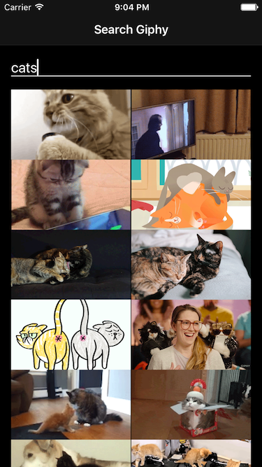
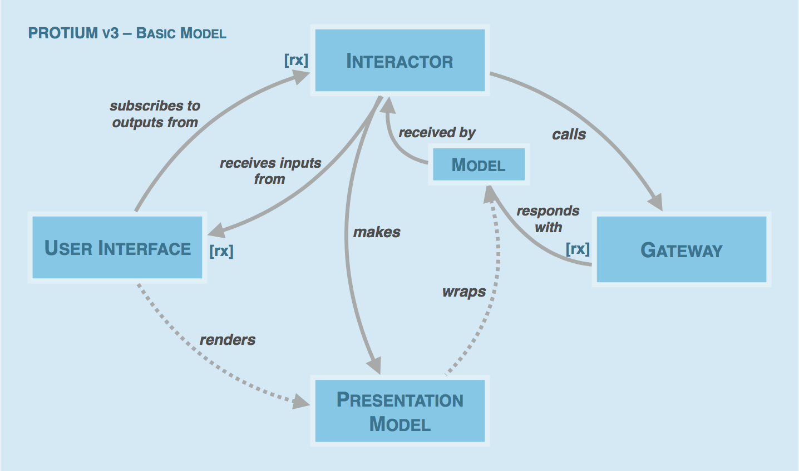
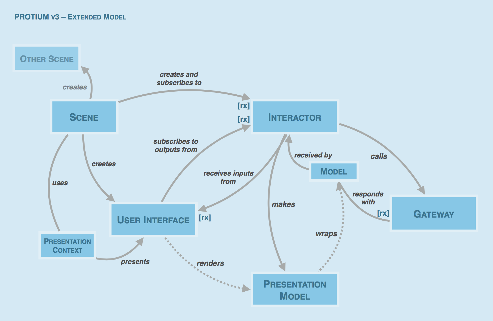
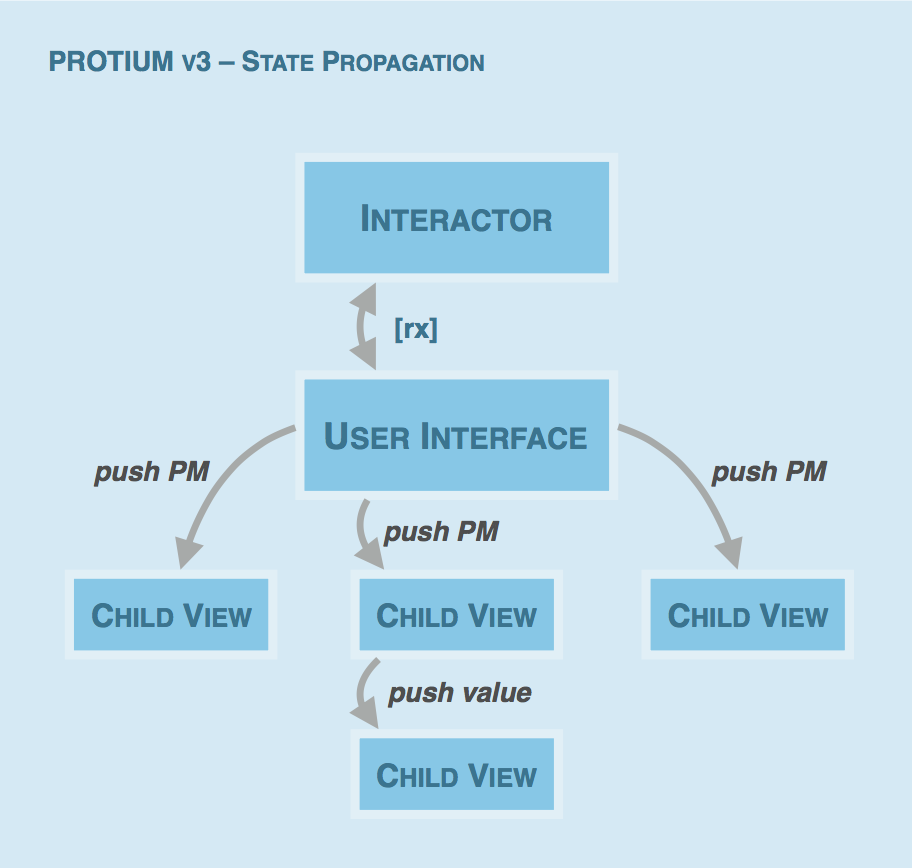

  

[](http://protium-labs.co/)
[](http://reactivex.io/)
[](http://giphy.com/)
[](https://developer.apple.com/swift/)
[](https://www.android.com/)

Protium is an **architecture** for **mobile applications** on iOS and Android. Like many other architectural approaches, it should merely be seen as recommendation rather than [panacea](https://en.wikipedia.org/wiki/No_Silver_Bullet) for solving all mobile development projects. Protium attempts to apply **solid** software engineering **principles** while capturing **modern** development **practices**. However, its main goal is to encourage **consistent code organization** using elements with clearly defined roles (or [Separation of Concerns](https://en.wikipedia.org/wiki/Separation_of_concerns)). 

The model has successfully been applied in a number of projects and constantly been refined (the latest version, **Protium v3** applies **reactive programming**). If you are new to mobile application architecture or struggling with finding a suitable approach for larger projects, even if you don't apply the entire architecture, you might find some ideas in this document on how to structure your next project. 

## Contents

- [A Short History](#a-short-history)
- [Credits](#credits)
- [Demo App](#demo-app)
- [In a Nutshell](#in-a-nutshell)
- [Extended Model](#extended-model)
- [State Propagation](#state-propagation)
- [Non-reactive Version](#non-reactive-version)
- [General Principles](#general-principles)
- [Interactor](#interactor)
- [User Interface](#user-interface)
- [Presentation Model](#presentation-model)
- [Gateway and Model](#geteway-and-model)
- [Scene and Presentation Context](#scene-and-presentation-context)
- [License](#license)

## A Short History
The first version of the architecture has been developed by a team of iOS and Android developers before (in 2014) starting development of a new mobile application for both platforms. The primary goal was to find an architecture and **common language** for concepts that could be applied both on **iOS and Android**. Since then, the architecture has been refined as strengths and weaknesses of the first version have become apparent on further mobile development projects. This document describes **Protium v3**, which is a **Rx-flavoured** version of the architecture. (The name PROTIUM was originally composed of **P**resenter **R**epository **O**bservable **T**ask **I**nteractor **U**I **M**odel. However, since elements have been renamed or removed over time, the name now does not strictly reflect the major parts of the architecture any more.)

### Credits
Nothing mentioned in this document is really novel. Quite the opposite, the entire architecture could be seen as consolidating well-known principles or components of other known architectures into one coherent model. Protium is heavily inspired by (list is probably incomplete): The CLEAN Architecture, VIPER, Flux, MVC/MVVM, Presentation Patterns such as Presenter/Presentation Model/View Model, ReactiveX Patterns, Domain-Driven-Design Patterns, SOLID Principles etc.

Major credits go to [@cachapa](https://github.com/cachapa), [@mhilscher](https://github.com/mhilscher), [@thomaspaulmann](https://github.com/thomaspaulmann) who engaged in endless discussion and analysis (paralysis ;) sessions about pros and cons of different approaches.

## Demo App
The demo application shows how the architecture could be applied in Swift project. (For a non-reactive Android demo, see [@cachapa](https://github.com/cachapa/Protium-Demo).) The app contains a screen with a search-as-you-type feature and an infinitely scrolling list. Tapping on a list item triggers navigation to a detail screen with some addtional actions. Although simple, this app demonstrates all elements of the Protium architecture including screen transitions.



## Protium v3
Before describing all parts and their roles in detail, the following section gives a **high-level overview** of the architecture and summarizes the **flow** starting from a user-triggered action through application layers back to updating the user interface. 

### In a Nutshell
Protium comprises several **essential** and **optional** elements. The central part where **business logic** resides and **state** is managed is the **Interactor**. It exposes a public interface for a "slice" of the application's use cases. The public interfaces consists of **reactive** **inputs** and **reactive outputs**: An **input** could be an action triggered in the **User Interface**, an **output** could be **Presentation Model** wrapped in a **reactive container**. To fetch data from the **network**, the Interactor uses **Gateways**, stateless facades that encapsulate network logic and asynchronously return **Models** in reactive containers. The **Interactor** post-processes Gateway responses by **creating** **Presentation Models** and dispatches updates through its reactive outputs. The **User Interface** subscribes to **Interactor outputs** and **renders** **Presentation Models**, that is, pushes Presentation Models to child views.



**Gateway** for network calls, **Rx-Observable** for state updates, as well as **Scene** and **Context** for view management and navigation (see below) could be regarded as **optional** while **Model**, **User Interface** and **Interactor** are the **essential** parts of the architecture. In the world of three-letter-architectures, Protium would be most similar to an **MVI** (Model View Interactor) architecture where the Interactor is similar to a View Model.

### Extended Model
In medium to large mobile applications, managing **presentation**, **routing** and **navigation** can get fairly complex. Without clear structures, this may easily lead to classes with low cohesion, i.e. large supervising classes listening to events from children and mediating their actions. The **extended** version of the Protium architecture includes two building-blocks for managing the presentation and navigation concerns: **Scene** and **Presentation Context**. (This approach is mainly inspired by [Srdan Rasic's reactive architecture "Scene-Stage-Director"](https://github.com/ReactiveKit/ReactiveGitter).) 

**Scene** acts as **factory** for the User Interface and Interactor and wires up the dependencies. To present the User Interface, Scene delegates to a **Presentation Context**, which encapsulates the **presentation and flow logic**. That way, Scene is freed from any knowledge of how the User Interface will be presented. **Scenes** can **subscribe** to reactive outputs from **Interactors** and **present other Scenes** to trigger screen transitions.



### State Propagation
Although Rx comes with a number of advantages, excessive use of Rx-Observables can lead to unanticipated effects and updates that are hard to control and debug. This architecture recommends limiting the scope of Rx by keeping reactive state mainly in the Interactor layer and only subscribe with top-level User Interface objects to updates. The parent User Interface then pushes immutable Presentation Model objects down to child views. As updates occur deeper in the view hierarchy, often only a subset of the Presentation Model properties is needed so that simple values can be used instead of pushing the entire models objects to the views.

Vice versa, actions occurring in nested view components are bubbled up and passed via User Interface input streams to the Interactor. Bubbling events up from child views to the User Interface can be implemented using standard delegation/listener patterns or closures. This keeps deeply nested view components free from Rx dependencies. The User Interface then transforms the events to Observable streams or directly uses Rx extensions for simple UI components at the root level. (For example, a button placed at the top level in the User Interface directly exposes its tap event as Observable stream when Rx UI extensions are used.)



### Non-reactive Version
If you prefer to not use Rx, you can still apply the architecture with some changes:
- Instead of returning Observables, Gateway methods could use completion closures/listeners (or Operations, Futures/Promises etc.).
- Instead of exposing input and output properties as Observables, Interactors could expose regular methods to be called by the User Interface. The methods should all return *Void* so that called actions and caused updates remain independent from each other. For Interactor outputs, you could employ the standard Observer pattern that enables local multi-cast subscription to instance properties. (For "poor man's Rx" on iOS, you could use [Mike Ash's ObserverSet](https://www.mikeash.com/pyblog/friday-qa-2015-01-23-lets-build-swift-notifications.html).)
- Scenes could subscribe to Interactor changes either via observable properties (see above), closures/listeners, or delegation.

### General Principles

#### Deliberate Use of Interfaces
**Dependency injection** is used throughout the entire architecture. However, needless creation and proliferation of interfaces/protocols should be avoided. Interfaces should only be added if there is a immediate and concrete use case. (For an interesting talk on the topic watch [Christin Gorman's talk](https://vimeo.com/138774243) about sustainable code.) 

For instance: It makes sense to let **Gateways** conform to interfaces since this allows for easy injection of **StubGateways** (for testing) into Interactors. Also, **Presentation Context** may conform to an interface. Depending on the use case, Scenes can then be provided with context objects and trigger different presentation logic at runtime. Interactors, on the other hand, may not need to conform to an interface, except you really want to inject different Interactor implementations into the User Interface for testing.

#### Vertical Slicing 
Code should not be organized based on type (i.e., do not create folders like "interactors", "gateways", "models" etc.) but rather be **grouped by feature**. If you structure your code along module boundaries, responsibilities are clearly separated and later extraction of features into frameworks becomes easier.

#### Value Types
Models and Presentation Models should be implemented as **immutable** value types (i.e., in a language such as Swift use structs) since this generally leads to code with less side-effects and higher performance. From the [Swift Developer blog](https://developer.apple.com/swift/blog/?id=10):

> One of the primary reasons to choose value types over reference types is the ability to more easily reason about your code. If you always get a unique, copied instance, you can trust that no other part of your app is changing the data under the covers. This is especially helpful in multi-threaded environments where a different thread could alter your data out from under you. This can create nasty bugs that are extremely hard to debug.

 The following sections contain detailed descriptions of all elements of the architecture.

### Interactor
The Interactor encapsulates the business logic and state for a defined part (or "subdomain") of the application, thereby limiting the scope of state changes to a coherent area of the application's use cases. To support a reactive programming model, the Interactor transforms input streams to output streams. Input streams are retrieved from User Interface actions and injected as dependency into the Interactor. (In the VIPER architecture, the Interactor implements input/output using protocols and delegation.)  

Another typical Interactor dependency is a Gateway for performing networking tasks. Gateways asynchronously return Model objects through Rx-Observables, which the Interactor then converts to Presentation Models. The Presentation Models, in turn, are exposed to the User Interface through reactive output streams.

```swift
// Simplified example of an Interactor for searching gifs. See demo app for a complete example.
final class GifSearchInteractor {
    // UI Outputs
    let gifList: Observable<[GifPM]>
    
    // Scene Outputs
    let cellSelected: Observable<GifPM>
    
    init(gateway: GifGate, actions: GifSearchUI.Actions) {
      // Setup properties...

      // Map input action stream containing search query to Gateway call, 
      // map Model response to Presentation Models.
      gifList = actions.search.asObservable()
          .flatMap { gateway.searchGifs(query: $0) }
          .map { $0.map(GifPM.init) }
    }
}
```

### User Interface
The User Interface (UI) is iOS applications is usually provided by View Controllers, on Android by Fragments, including their custom view components. The main purpose of the UI is to render state updates and configure child views. Since it holds a strong reference to the Interactor, when the UI is removed, it automatically causes deallocation of all dependent elements (provided that no other elements hold references). By subscribing to the reactive properties exposed by the Interactor, the UI can either directly bind to child views using Rx extensions or push Presentation Models down to views. 

On the one hand, the UI subscribes to Interactor output streams and renders child views. On the other hand, the UI exposes a set of actions as input streams. These input streams are fed as dependency into the Interactor, which then subscribes to the streams and performs its use cases. The User Interface fulfills a mediating role and delegates the actual rendering to its passive child views (i.e., the "controlling" concern of View Controllers on iOS or Fragments on Android). Any business or flow logic, however, is not part of the UI and handled by other elements, e.g. Interactors or Scenes/Presentation Context objects.

```swift
// Simplified example of a User Interface for searching gifs. See demo app for a complete example.
final class GifSearchUI: UIViewController {
    // Property definitions...

    override func viewDidLoad() {
        // Use Rx extensions to bind the Interactor output to a list view.
        // Each cell receives a Presentation Model through a setter that updates the cell.
        interactor.gifList.asDriver()
            .drive(collectionView.rx.items(
                cellIdentifier: GifCell.reuseIdentifier, 
                cellType: GifCell.self)) { index, model, cell in
                    cell.model = model
            }
            .addDisposableTo(disposeBag)
    }
}

// Definition of a struct type the contains all exposed input actions.
// These streams can then be injected into the Interactor as single value.
extension GifSearchUI {
    struct Actions {
        let search: Observable<String>
        let cellSelected: Observable<GifPM>
    }
    
    var actions: Actions {
        return Actions(
            search: searchTextField.rx.text.asObservable(),
            cellSelected: collectionView.rx.modelSelected(GifPM.self).asObservable()
        )
    }
}
```

### Presentation Model
A Presentation Model (PM) is created by the Interactor, typically by using a one-liner such as a *map* function that initializes the PM with a Model. The PM wraps a plain Model returned from a Gateway and exposes only the view-related properties for rendering. PM properties are read-only and are often computed (by simply delegating to a subset of the getters of the underlying model). For expensive calculations, values of stored properties can be calculated at initialization time or later using lazy initialization. 

String or date formatting and all other properties needed for display purposes are well-suited for Presentation Models. In addition, PMs can be handy for caching objects such as images. Views can use the Presentation Model object to render their entire state. Presentation Models may also contain child models, for instance, a list could contain an array of child PMs for each cell. In addition to Model properties, the cell PM could contain properties for the selected or loading state of a cell.  

```swift
// Simplified example of a Presentation Model for a Gif Model. See demo app for a complete example.
struct GifPM {
    // Computed properties delegate to Model properties.
    var url: URL? { return model.url }
    var imageURL: URL? { return model.originalImageURL }

    // Other (lazy) stored properties...
   
    // Underlying Model object.
    private let model: Gif
   
    // Initializer that allows for simple creation of Presentation Models: 
    // GifPM(model) or models.map(GifPM.init).
    init(_ model: Gif) {
        self.model = model
    }
}
```

### Gateway and Model
Gateways are stateless facades that encapsulate the logic for accessing external services. (The naming has been [suggested by Martin Fowler](http://martinfowler.com/articles/refactoring-external-service.html).) Internally, the Gateway uses the networking stack of the OS or a convenience networking library to carry out the actual calls and parse the result into Model objects. By asynchronously returning responses via Rx-Observables, Interactors can easily chain calls and handle errors. 

Gateways may also conform to an interface definition so that different implementations can be injected into Interactors. A common use case is to start with a StubGateway that returns hard-coded responses and then use the stub for early development or testing.

```swift
// Simplified example of a Gateway for a Gifs. See demo app for a complete example.

// Typealias definitions...

protocol GifGate {
    func searchGifs(query: String, page: GifPage) -> Observable<GifList>
    func fetchTrendingGifs(limit: Int) -> Observable<GifList>
}

final class GifGateway: GifGate {
  func searchGifs(query: String, page: GifPage) -> Observable<GifList> {
    // Each Gateway method returns an Rx-Observable.
    // Use your favorite network stack to carry out the network operation.
    // Use your favorite JSON mapper to parse the result into a Model...
  }

  // Implementations of protocol methods...
}
```

```swift
// Simplified example of a Model struct for a Gif. See demo app for a complete example..
struct Gif {
    let id: String
    let url: URL?
    let imageURL: URL?
}

extension Gif {
    init(_ json: JSON) {
      // Setup properties based on JSON...
    }
}
```

### Scene and Presentation Context
Scene and Presentation Context organize the presentation, routing and navigation concerns. As an application becomes larger, handling these tasks in central manager classes or directly in the User Interface quickly results in difficult-to-maintain code. Scenes support transitioning to new screens by encapsulating the creation of User Interfaces and presenting them. The Scene acts as factory for User Interfaces, Interactors, and other Scenes. (Scenes are similar to Wireframes in the VIPER architecture. Also see [Srdan Rasic's reactive architecture "Scene-Stage-Director"](https://github.com/ReactiveKit/ReactiveGitter).) Scenes also subscribe to output streams from Interactors, for instance in order to present a new Scene. 

The actual presentation (i.e., where and how the User Interface is presented) is delegated to a Presentation Context, which is injected into the Scene. The Presentation Context attaches the view to its parent User Interface and triggers screens transitions. Each presentation style, for example modal/non-modal presentation or special-purpose presentations such as wizards, is implemented in a separate class. Ideally, the Context implements an interface so that Scenes can be provided with different implementations at runtime since a Scene could be presented differently depending on how the user enters the application. 

A Scene's existing Presentation Context or a newly created child context object is usually passed down to other presented Scenes. (For a similar solution, also see [Soroush Khanlou's post on the Coordinator pattern](http://khanlou.com/2015/01/the-coordinator/).)

```swift
// Simplified example of a Scene. See demo app for a complete example..
final class GifSearchScene {
    // Property definitions...
    
    init(context: NavigationContext, gateway: GifGate) {
      // Setup properties...
    }
    
    func presentInContext() {
        context.push(ui())
    }

    private func ui() -> UIViewController {
      // Create User Interface and Interactor.
      // Subscribe to Interactor outputs if needed and present other Scenes.
    }
}
```

```swift
// Simplified example of a Presentation Context. See demo app for a complete example.

// Protocol for all Presentation Context objects.
protocol Context {
    func present(_ ui: UIViewController)
}

// NavigationContext as special type of Context with support of stack-like push/pop presentation.
protocol NavigationContext: Context {
    func push(_ ui: UIViewController)
    func pop()
}

final class NavigationControllerContext: NavigationContext {
    // Property definitions...

    init(parent: Context) {
        self.parent = parent
    }

    func push(_ ui: UIViewController) {
      // Push presentation logic...
    }

    // Other protocol implementations...
}
```

### License
MIT license. See the LICENSE file for more info.

